<!--
  Profile README for github.com/11lunaric11. Portrait (370) + info card (490)
  sit in a table so they're the same height; the graph is refreshed daily by
  .github/workflows/update-profile-art.yml.
-->

<table>
<tr>
<td valign="top"></td>
<td valign="top"></td>
</tr>
</table>

## lunaric

**Security Researcher · Bug Bounty · Web Dev · Student**

 

<!-- animated contribution graph, refreshed daily by the workflow -->

